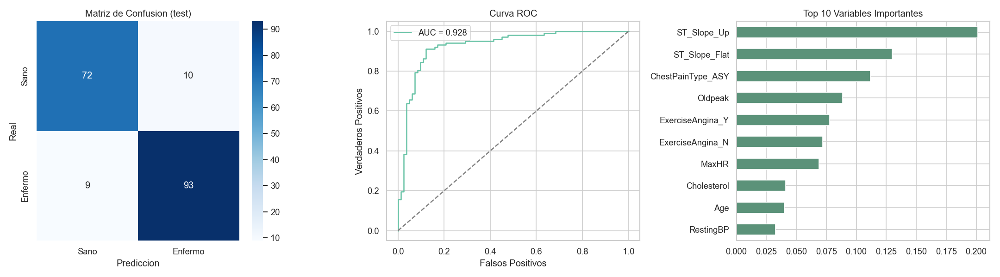
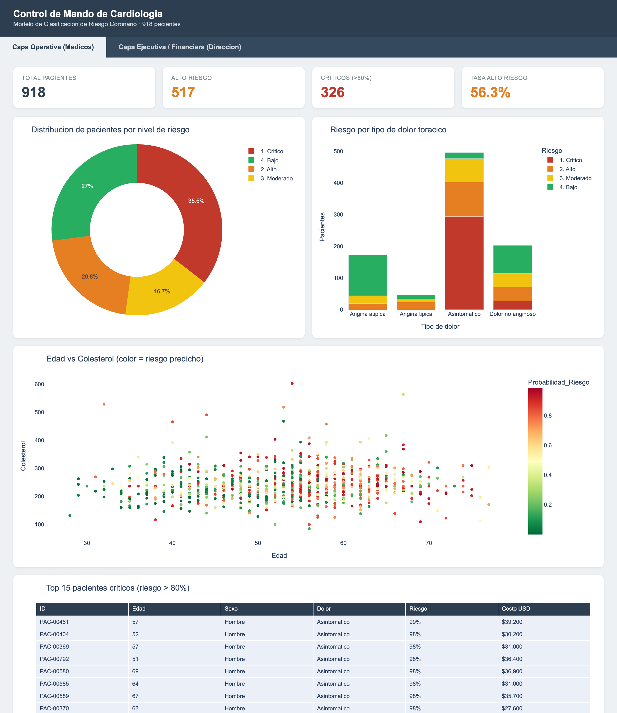
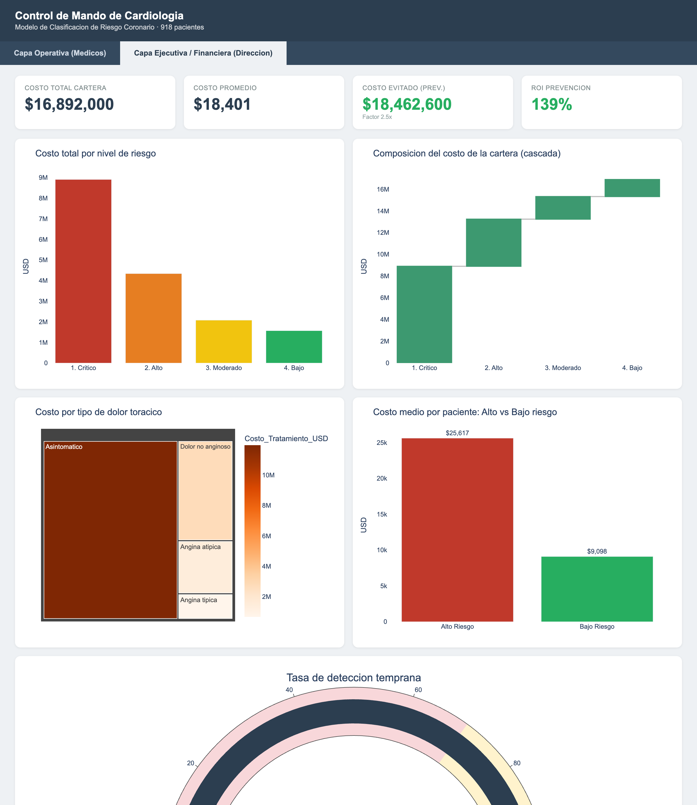
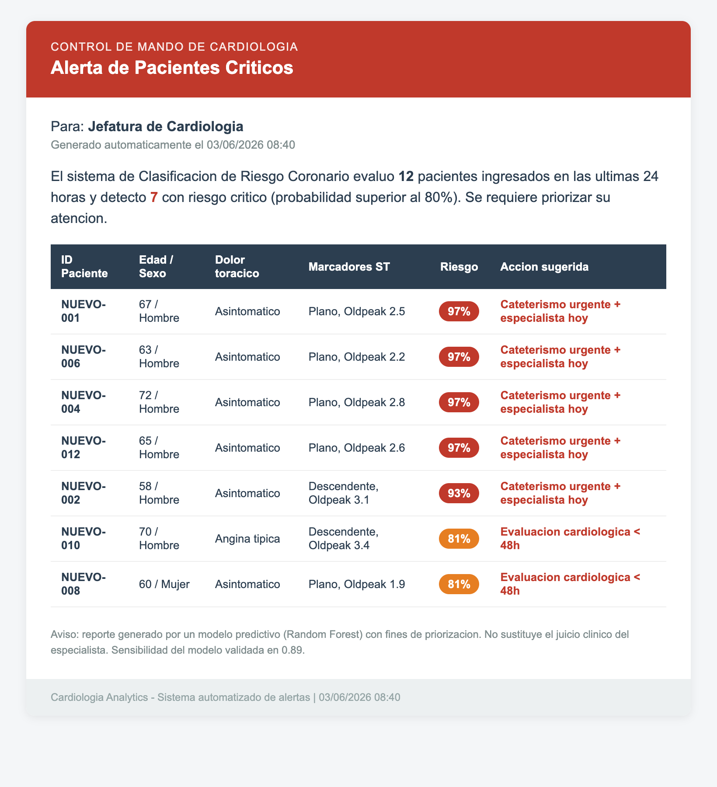

# Cardiology Analytics — End-to-End Coronary Risk System

> 🌐 *Read this in [Español](README.md)*

> An **end-to-end** portfolio project blending Data Science, Business Intelligence and
> clinical automation on the **Heart Failure Prediction** dataset (918 patients).
> From data cleaning to an executive dashboard and a critical-patient alerting system.


---

## The business problem

A private cardiology hospital needs to **prioritize care** for patients at highest
coronary risk while **optimizing treatment spend**. This project delivers three pieces
that work together:

1. A **predictive model** that classifies each patient's coronary risk.
2. A **two-layer executive dashboard** (clinical and financial).
3. An **alerting system** that flags critical patients to leadership every day.

---

## Key results

| Metric | Result |
|---|---|
| ROC-AUC (test) | **0.928** |
| Sensitivity / Recall | **0.912** |
| 5-fold cross-validation (AUC) | 0.925 ± 0.026 |
| High-risk patients identified | 517 of 918 |
| Total portfolio cost (simulated) | $16.89M |
| Early-detection rate | 88.6% |

---

## 1. Predictive Model — Coronary Risk Classification

An interpretable Random Forest with an encoding pipeline plus out-of-fold
cross-validation to assign an honest, leakage-free risk score to every patient.



The most predictive features (ST slope, asymptomatic chest pain, ST depression) match
the classic clinical markers of ischemic heart disease.

---

## 2. "Cardiology Command Center" Dashboard

An interactive **two-layer** dashboard (self-contained HTML+Plotly version; it also
includes a full Power BI / DAX measures guide in [`docs/`](docs/fase3_dashboard_powerbi.md)).

### Operational Layer (Physicians)
High-risk patient alerts, segmentation by chest-pain type, and an Age vs Cholesterol
scatter colored by predicted risk.



### Executive / Financial Layer (Leadership)
Treatment cost crossed with risk levels, a prevention-savings model (scenario
parameter) and the early-intervention success rate.



---

## 3. Automated Report — Critical Patient Alerts

A daily process that runs the model over the last 24h admissions, filters patients with
risk > 80% and generates an HTML email with a prioritized table for the Cardiology
leadership (urgent catheterization, priority assessment, etc.).



---

## Project architecture

```
Phase 1: EDA + business variables    ->  heart_preparado.csv
Phase 2: Random Forest + scoring     ->  heart_enriquecido.csv + modelo_rf.joblib
Phase 3: Two-layer dashboard         ->  dashboard_cardiologia.html  (+ DAX guide)
Phase 4: Daily critical alerts       ->  automated HTML email
```

## Tech stack

- **Data / ML:** Python, Pandas, NumPy, scikit-learn (Random Forest, Pipelines, CV).
- **Visualization:** Plotly (interactive dashboard), Matplotlib/Seaborn (EDA), Power BI / DAX (guide).
- **Automation:** joblib (model persistence), HTML/SMTP (alerts), cron.

## How to run

```bash
pip install -r requirements.txt

python notebooks/fase1_eda_preparacion.py     # EDA and preparation
python notebooks/fase2_modelo_riesgo.py       # Model + enriched CSV
python notebooks/build_dashboard.py           # Interactive dashboard (HTML)
python notebooks/fase4_alertas_criticas.py    # Critical patient alerts
```

Each phase also ships an executed notebook in [`notebooks/`](notebooks/).

## Structure

```
cardiologia-analytics/
├── data/            original dataset + simulated patients (Phase 4)
├── notebooks/       .py scripts and .ipynb notebooks per phase
├── docs/            Power BI guide (DAX) + screenshots
├── output/          CSVs, model, dashboard HTML, email and charts
├── requirements.txt
└── README.md
```

---

## A note on analytical honesty

`Costo_Tratamiento_USD` is a **simulated** variable built from a severity- and
age-weighted formula (documented in Phase 1), since the public dataset has no financial
data. The "early-detection" and "cost avoided" metrics use the real diagnosis label to
demonstrate the model's historical value; in production that ground truth is not
available for new patients.

*Dataset: [Heart Failure Prediction (fedesoriano) — Kaggle](https://www.kaggle.com/datasets/fedesoriano/heart-failure-prediction).*
